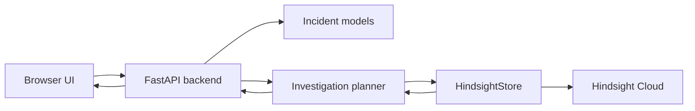

# Incident Learning Agent

> **An incident-response agent that remembers what failed, what worked, and changes the next investigation.**

**Live demo:** https://incident-learning-agent-qwqc.onrender.com/

**GitHub:** https://github.com/sharonmedithi0304/incident-learning-agent

**Memory layer:** [Hindsight](https://hindsight.vectorize.io/)

---

## The problem

Production incidents create knowledge that is easy to lose.

An engineer investigates an outage, forms a hypothesis, tries a mitigation, discovers that it failed, finds the real root cause, and finally resolves the incident. A month later, a similar incident appears—and the next engineer starts over.

The question behind this project is:

> **What changes when an incident-response agent can remember the outcomes of previous investigations?**

This project focuses on one workflow:

```text
Past incident
    ↓
Retain the full experience
    ↓
Hindsight memory
    ↓
Recall relevant prior experience
    ↓
Current incident
    ↓
Changed investigation priorities
```

The goal is not to make the agent "remember more text." The goal is to make memory **change what the agent does next**.

---

## The 60-second proof

The demo uses two checkout incidents.

### Historical incident — `INC-1041`

- Checkout p99 latency: **4.8s**
- Deployment: `v3.8.2`
- Initial hypothesis: **database overload**
- Action: **increase DB capacity → FAILED**
- Actual root cause: **connection-pool exhaustion**
- Successful mitigation: **roll back the connection-pool configuration**

### Current incident — `INC-1187`

- Checkout p99 latency: **5.1s**
- Deployment: `v3.9.0`
- Intermittent 504s
- DB CPU: 55%
- Error rate: 2%

### Memory OFF

The agent sees only the current incident and produces a generic investigation:

```text
Review deployment
Inspect DB
Scale DB if saturated
Inspect logs
Check dependencies
```

### Memory ON

Hindsight recalls relevant historical experience and the plan changes:

```text
1. Test the recalled root-cause hypothesis
2. Prepare the mitigation that worked before
3. Review deployment changes
4. Inspect DB
5. ...
N. DEPRIORITIZE: scale database capacity
```

The important part is not the recalled incident itself.

**The important part is that a previously failed action is demoted and a successful mitigation is surfaced—while the historical root cause remains explicitly unconfirmed for the current incident.**

---

## Why this is memory—not just retrieval

A retrieval system can return a runbook that says:

> "If the database is overloaded, increase capacity."

Incident memory can return something more useful:

> "We increased database capacity during a similar incident. It failed. The actual issue was elsewhere, and rolling back the changed configuration resolved it."

That difference matters during an outage.

This application treats an incident as **experience** rather than a transcript:

```text
Context
  +
Hypothesis
  +
Action
  +
Outcome
  +
Root cause
  +
Mitigation
  =
Reusable operational experience
```

---

## How the memory loop works

### 1. Retain

`POST /api/seed` stores `INC-1041` in Hindsight as an atomic incident narrative containing symptoms, actions, outcomes, root cause, mitigation, and resolution.

### 2. Recall

`Memory ON` calls Hindsight for prior incidents relevant to the current incident's service, symptoms, deployment pattern, and signals.

### 3. Extract experience

The planner separates recalled evidence into reusable categories:

- **Root-cause evidence** → a hypothesis to verify
- **Successful mitigation** → a conditional action to prepare
- **Failed action** → a warning or deprioritization candidate

The planner does not require one specific incident ID or one specific technology story.

### 4. Change the investigation

The current investigation is layered over a generic baseline:

```text
Memory OFF
    → current incident only
    → generic baseline

Memory ON
    → current incident
    + Hindsight evidence
    → hypotheses / mitigations / failed actions
    → modified priorities
```

### 5. Explain the change

Every memory-driven step carries a human-readable rationale and evidence reference so the UI can answer:

> **"Why did the plan change?"**

---

## Architecture



The code deliberately separates three concerns:

**Retrieval** — `HindsightStore` talks to Hindsight and maps results into the internal `Memory` model.

**Experience extraction** — `insight.py` classifies recalled text into failed actions, successful mitigations, and root-cause statements.

**Planning** — `agent.py` combines the current incident with recalled experience and builds a traceable investigation plan.

See [`docs/ARCHITECTURE.md`](docs/ARCHITECTURE.md) for the implementation contract.

---

## Evidence contract

The UI is designed around a simple rule:

> **A memory-driven change must be explainable from recalled evidence.**

A changed step carries:

- `source` — `memory` or `generic`
- `rationale` — why the step moved
- `evidence_ids` — human-readable incident/document references
- `deprioritized` — whether a baseline action was demoted

The judge-facing interface hides raw Hindsight memory UUIDs and surfaces the incident-level evidence instead.

---

## Uncertainty is intentional

Historical memory is evidence, not proof.

The agent therefore distinguishes:

```text
Historical evidence
        ≠
Current evidence
        ≠
Confirmed diagnosis
```

For example:

> **Leading hypothesis:** connection-pool exhaustion — recalled from `INC-1041`; **unconfirmed against current incident evidence**.

The system never claims that a previous root cause automatically proves the new incident.

---

## Generalization test

The project includes a separate synthetic incident that has nothing to do with connection pools:

```text
notification-worker
    ↓
stuck scheduler
    ↓
failed mail-queue restart
    ↓
scheduler restart succeeded
```

The purpose of this test is simple:

> **Can historical experience change the investigation even when the lesson is different from the demo storyline?**

This protects the core claim from becoming an `INC-1041` special case.

See [`docs/EVALUATION.md`](docs/EVALUATION.md).

---

## Demo flow

The entire proof can be shown through four buttons:

```text
1. Seed historical incident
2. Investigate · Memory OFF
3. Investigate · Memory ON
4. Compare
```

The strongest moment is the transition:

```text
FAILED historical action
          +
SUCCESSFUL historical mitigation
          +
ROOT-CAUSE evidence
          ↓
Different investigation priorities
```

See [`docs/DEMO_SCRIPT.md`](docs/DEMO_SCRIPT.md) for the exact walkthrough.

---

## Run locally

### Windows

```powershell
python -m venv .venv
.venv\Scripts\activate
pip install -r requirements.txt
```

Create `.env` from `.env.example`.

For real Hindsight Cloud:

```env
HINDSIGHT_BASE_URL=https://api.hindsight.vectorize.io
HINDSIGHT_API_KEY=<your-key>
```

Optional Anthropic configuration is supported by the project, but the core memory loop does not require a visible LLM call in the UI.

Start the app:

```powershell
uvicorn app.main:app --reload --app-dir backend
```

Open:

```text
http://127.0.0.1:8000
```

### Local development without Hindsight

Leave `HINDSIGHT_BASE_URL` empty to use the explicit `FAKE MEMORY · LOCAL DEV` backend used by the test suite.

**Never commit `.env`.**

---

## API

| Endpoint | Purpose |
| --- | --- |
| `GET /api/health` | Backend/Hindsight health status |
| `GET /api/scenario` | Current demo incidents |
| `POST /api/seed` | Retain `INC-1041` in memory |
| `POST /api/investigate` | Run investigation with memory ON/OFF |
| `POST /api/compare` | Generate the before/after comparison |

Example:

```json
POST /api/investigate
{
  "memory": true
}
```

Set `"memory": false` for the baseline.

---

## Testing

Run:

```powershell
python -m pytest -q
```

Current local validation:

```text
20 passed
```

The suite covers the memory contract, including:

- Memory OFF isolation
- memory-driven plan changes
- successful mitigation surfacing
- failed-action deprioritization
- unrelated-memory filtering
- a different historical incident
- API error conversion
- Hindsight result mapping
- backend selection
- secret-safe settings representation

The live Hindsight round-trip test is environment-gated and runs when `HINDSIGHT_BASE_URL` is configured.

---

## Safety boundaries

This is an **incident investigation assistant**, not an autonomous production operator.

It:

- does not execute production actions
- does not treat historical memory as proof
- surfaces historical failures as cautionary evidence
- keeps Memory OFF independent of Hindsight recall
- does not silently switch to fake memory when Hindsight is explicitly configured
- keeps secrets out of the repository

The intended decision loop is:

```text
Agent suggests
      ↓
Engineer verifies against current telemetry
      ↓
Engineer decides what to do
```

---

## Known limitations

- The demonstration uses realistic synthetic incident data.
- Historical similarity is evidence, not a diagnosis.
- Hindsight availability is an external dependency.
- Memory quality depends on the quality and specificity of retained incident experience.
- The current scope focuses on investigation prioritization rather than fully automated remediation.

These are deliberate boundaries rather than hidden assumptions.

---

## Project structure

```text
incident-learning-agent/
├── backend/
│   ├── app/
│   │   ├── agent.py             # investigation planning
│   │   ├── hindsight_store.py   # Hindsight integration
│   │   ├── insight.py           # experience extraction
│   │   ├── main.py              # FastAPI app + endpoints
│   │   ├── models.py            # domain models
│   │   ├── seed.py              # demo incidents
│   │   └── ...
│   └── tests/
│       ├── test_agent.py
│       ├── test_api.py
│       └── test_store.py
├── frontend/
│   └── index.html               # judge-facing demo UI
├── docs/
│   ├── ARCHITECTURE.md
│   ├── DEMO_SCRIPT.md
│   └── EVALUATION.md
├── .env.example
├── .gitignore
├── pytest.ini
├── requirements.txt
└── README.md
```

---

## Hindsight

This project uses [Hindsight](https://hindsight.vectorize.io/) as its persistent memory layer.

- [Hindsight documentation](https://hindsight.vectorize.io/)
- [Hindsight GitHub](https://github.com/vectorize-io/hindsight)
- [Vectorize — Agent Memory](https://vectorize.io/what-is-agent-memory)

The integration is intentionally visible in the product: **retain → recall → evidence → changed investigation**.

---

## The idea in one sentence

> **An incident is not just what happened—it is what the team learned, what failed, what worked, and what the next engineer should investigate differently.**
